# Проект экранов PISTOL GENESIS

[Русская версия — 24 проверенных макета](ru/README.md). Английская версия пока не получена. [Общий manifest](manifest.json) учитывает стадии раздельно.

---

# Исходные экраны приложения

Первоначальные макеты TimeFlame, сохранённые без изменения пикселей. Это исходная версия для последующей переработки в GENESIS, а не новые русская/английская версии.

**18 входных файлов → 17 уникальных изображений.** `MainScreenWeeklyDark-1.png` совпадает с `MainScreenWeeklyDark.png`; оба исходных имени закреплены за одной записью manifest.

Язык исходников смешанный: основная часть интерфейса русская, есть английские заголовки и placeholders. Поэтому этап называется `original`, а не `ru` или `en`. Содержимое изображений, брендинг и исходные размеры сохранены.

## Названия и стадии

Формат: `original/<раздел>/<экран-или-состояние>-<dark|light>.png`.
Стабильный id одинаково обозначает состояние в будущих стадиях: `ru/<раздел>/...` и `en/<раздел>/...`. Русская версия размещена отдельно в `ru/`; английская будет добавлена в `en/` после получения и визуальной проверки. Исходники сохранены для сравнения.

Важные различия:

- `weekly-task-actions-light`: открыты кнопки редактирования и удаления, это не обычный недельный экран.
- `task-created-dark`: подтверждение успешного добавления задачи, а не экран окончания записи.
- `settings-menu`: компактное меню настроек поверх календаря, а не отдельный полноэкранный экран.
- `task-edit-light`: нижняя панель редактирования задачи.

## Каталог

| Экран / состояние | Тема | Изображение |
|---|---|---|
| Вход в аккаунт | Тёмная | <a href="original/auth/login-dark.png">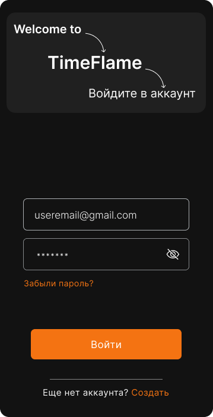</a> |
| Вход в аккаунт | Светлая | <a href="original/auth/login-light.png">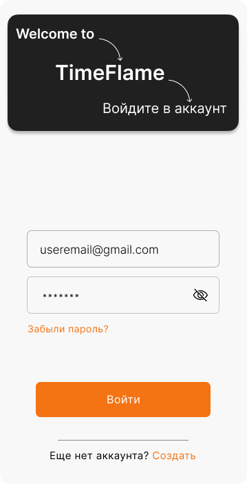</a> |
| Регистрация аккаунта | Тёмная | <a href="original/auth/register-dark.png">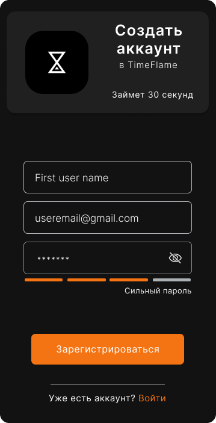</a> |
| Регистрация аккаунта | Светлая | <a href="original/auth/register-light.png">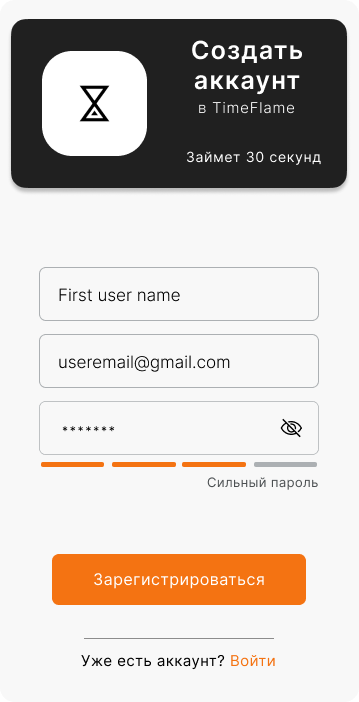</a> |
| Сброс пароля | Тёмная | <a href="original/auth/password-reset-dark.png">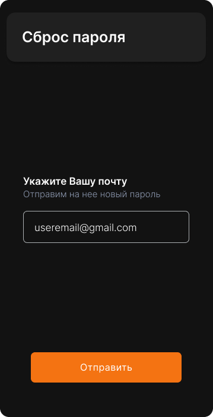</a> |
| Сброс пароля | Светлая | <a href="original/auth/password-reset-light.png">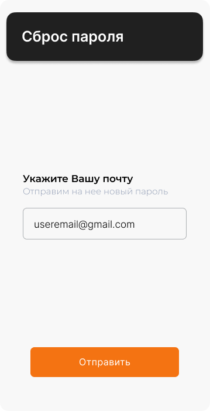</a> |
| Недельный календарь и список задач | Тёмная | <a href="original/calendar/weekly-dark.png">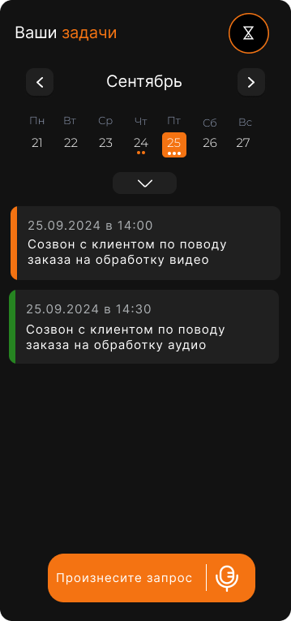</a> |
| Недельный календарь — действия над задачей | Светлая | <a href="original/tasks/weekly-task-actions-light.png">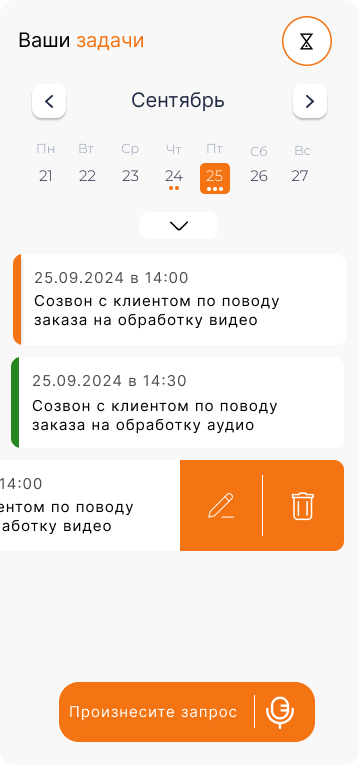</a> |
| Месячный календарь и список задач | Тёмная | <a href="original/calendar/monthly-dark.png">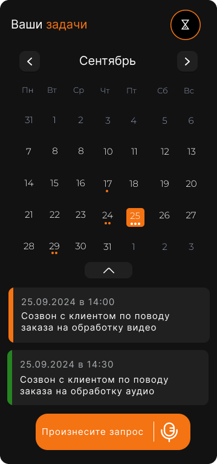</a> |
| Месячный календарь и список задач | Светлая | <a href="original/calendar/monthly-light.png">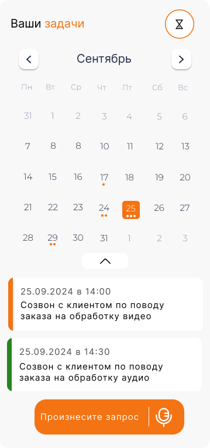</a> |
| Всплывающее меню профиля | Тёмная | <a href="original/profile/profile-menu-dark.png">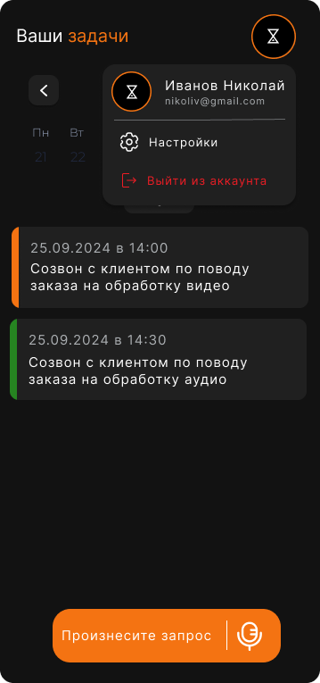</a> |
| Всплывающее меню профиля | Светлая | <a href="original/profile/profile-menu-light.png">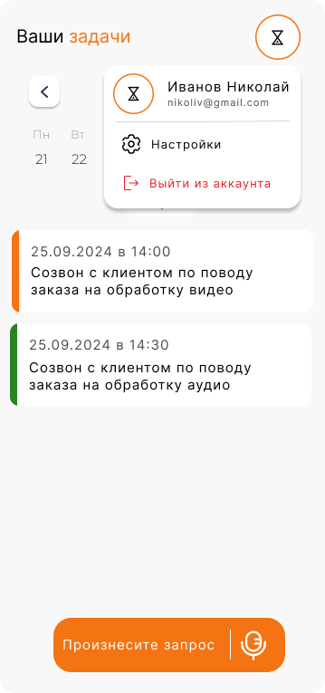</a> |
| Меню настроек темы и языка | Тёмная | <a href="original/profile/settings-menu-dark.png">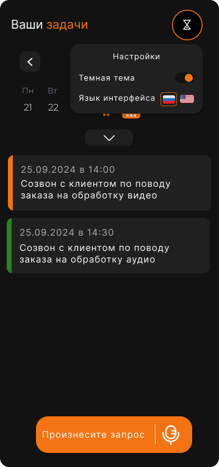</a> |
| Меню настроек темы и языка | Светлая | <a href="original/profile/settings-menu-light.png">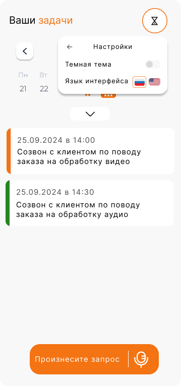</a> |
| Голосовой ввод — текст запроса и подтверждение | Тёмная | <a href="original/voice/voice-input-dark.png">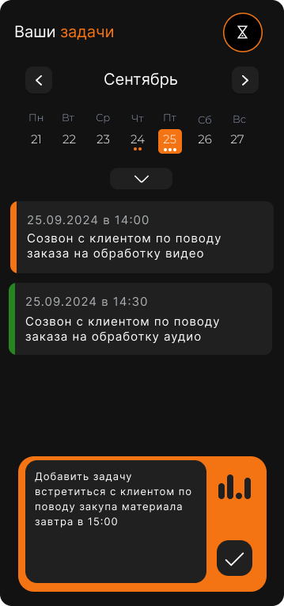</a> |
| Задача успешно добавлена | Тёмная | <a href="original/tasks/task-created-dark.png">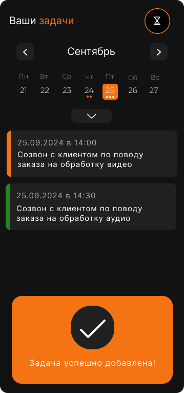</a> |
| Редактирование задачи — нижняя панель | Светлая | <a href="original/tasks/task-edit-light.png">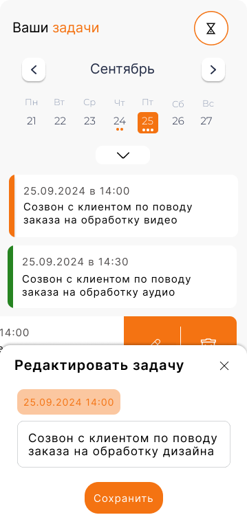</a> |

## Учёт файлов

[manifest.json](manifest.json) содержит id, стадию, фактический язык исходника, назначение, тему, путь, исходные имена, размеры и SHA256. [Сопоставление старых имён](original-file-mapping.md) сохраняет историю переименования. Приложение и API этим обновлением не изменены.
